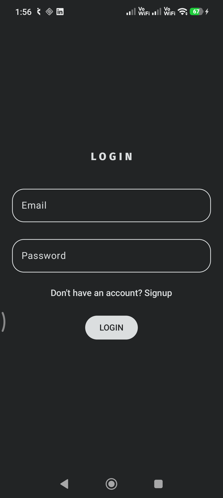
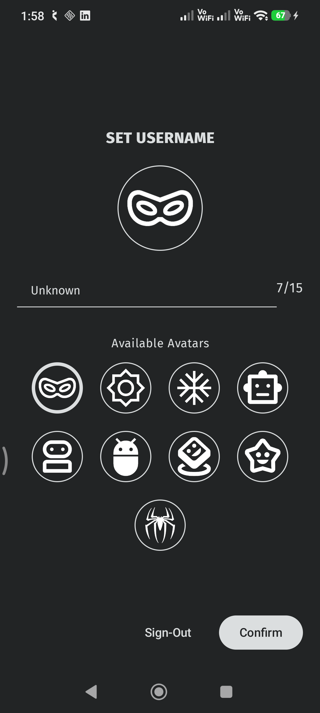
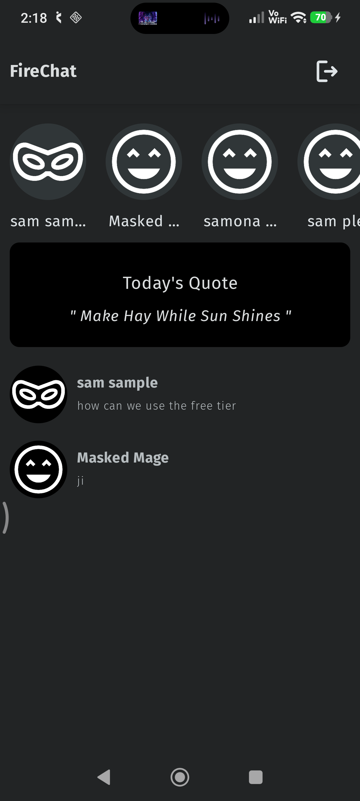

<div align="center">

<!-- BANNER / LOGO -->


<br/>
<br/>

<!-- BADGES -->


<br/>

### 🚀 *To connect with your friends.*

[**Report Bug**](../../issues)  ·  [**Request Feature**](../../issues)

</div>

---

## 📋 Table of Contents

- [About](#-about)
- [Visuals](#-visuals)
- [Features](#-features)
- [Tech Stack](#-tech-stack)
- [Installation](#-installation)

---

## 🧭 About

> **Fire-Chat** is an Android application built with Kotlin and Jetpack Compose that facilitates users with an account in this app to communicate with each other, similar to other messaging apps.

---

## 🎬 Visuals

<div align="center">

| Authentication | Set Username | Home |
|:-----------:|:--------------:|:--------:|
|  |  |  |

</div>

---

## ✨ Features

| Feature | Description |
|---|---|
| 🪪 **Authentication** | Users can create an account with email and password |
| 💬 **Chat** | Users can openly communicate with each other |
| ⬅️ **Unread message handling** | In progress |

---

## 🛠 Tech Stack

<div align="center">

| Layer | Technology |
|---|---|
| **Language** |  |
| **UI** |  |
| **Architecture** | `MVVM` + `Clean Architecture` |
| **Async** |  + `Flow` |
| **Navigation** | `Compose Navigation` |
| **Build** |  with `Version Catalogs` |

</div>

---

## 📦 Installation

### Prerequisites

- Android Studio **Hedgehog** (2023.1.1) or newer
- JDK **17**
- Android SDK with **API Level 24+**
- A device or emulator running **Android 7.0 (Nougat)** or above

### Clone & Build

```bash
# 1. Clone the repository
git clone "repo remote url."

# 2. Navigate to the project directory
cd app_name

# 3. Open in Android Studio
# File → Open → select the project folder

# 4. Set up a project in Firebase
This project uses my Firebase console project
To make this app functional, create your own Firebase project and download the google-services.json file
Add that file to the/app folder

# 5. Sync and Test
Sync Gradle and run it
If there is any error, verify the cause in the console
```

```bash
# Or build directly from the command line
./gradlew assembleDebug
```

### Download APK

| Version | Date | Download |
|---|---|---|
| `v1.0` | Coming soon | [](../../releases) |

---

> Have an idea? [Open a feature request](../../issues/new) — contributions are welcome!

---

## 📄 License

```
MIT License

Copyright (c) 2026 Your Name

Permission is hereby granted, free of charge, to any person obtaining a copy
of this software and associated documentation files (the "Software"), to deal
in the Software without restriction, including, without limitation, the rights
to use, copy, modify, merge, publish, distribute, sublicense, and/or sell
copies of the Software.
```

---

<div align="center">

Made with ❤️ using **Kotlin** & **Jetpack Compose**

⭐ If this project helped you, consider giving it a star!

</div>
